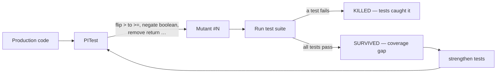
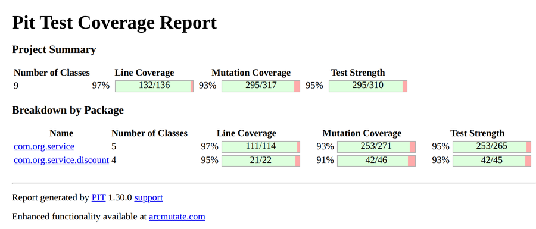
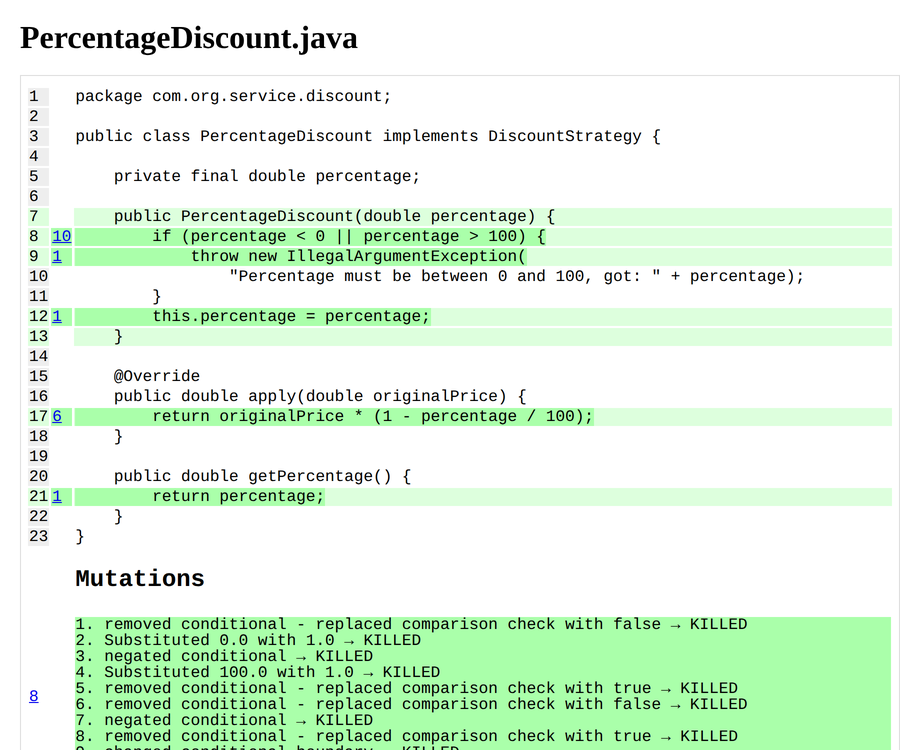

# <span style="color:hsl(74,80%,58%)">Mutation Testing with PITest</span>

<picture>
  <source media="(prefers-color-scheme: dark)" srcset="https://raw.githubusercontent.com/hcoles/pitest-site/gh-pages/images/pit-white-150x152.png">
  
</picture>

## <span style="color:hsl(212,80%,58%)">Table of contents</span>

1. 🧬 [What is Mutation Testing?](#what-is-mutation-testing)
2. 🔨 [Parent POM Hierarchy](#parent-pom-hierarchy)
3. 🏗️ [Project Structure](#project-structure)
4. 🏗️ [Design Patterns (GoF)](#design-patterns-gof)
5. 🧰 [Tech Stack](#tech-stack)
6. 🧪 [JUnit 5 Features Used](#junit-5-features-used)
7. 🧬 [PITest Mutation Coverage — What Each Test Kills](#pitest-mutation-coverage--what-each-test-kills)
8. 🧪 [Running Tests](#running-tests)
9. 🧬 [Running Mutation Coverage Only](#running-mutation-coverage-only)
10. 📚 [References](#references)

A Maven project demonstrating mutation testing using [PITest](https://pitest.org) with JUnit 6 (Jupiter API) and Java 25. Current run: 169 tests, 317 mutations, 93% killed, test strength 95%.
Inherits shared plugin management from the corporate `super-pom`.

---

<a id="what-is-mutation-testing"></a>
## <span style="color:hsl(349,80%,58%)">1. 🧬 What is Mutation Testing?</span>

Mutation testing evaluates test-suite quality by automatically introducing small code changes (mutations)
into production source — flipping `>` to `>=`, negating a boolean, removing a return value — then running
the tests against each mutated version.

| Result       | Meaning                                               |
|--------------|-------------------------------------------------------|
| **Killed**   | At least one test failed — the mutation was caught. ✓ |
| **Survived** | All tests passed — a coverage gap was revealed. ✗     |

The goal is to maximise the percentage of killed mutants.



---

<a id="parent-pom-hierarchy"></a>
## <span style="color:hsl(127,80%,58%)">2. 🔨 Parent POM Hierarchy</span>

```
org.springframework.boot:spring-boot-starter-parent:4.1.0
  └── com.org.llm:super-pom:1.1.3
        └── com.org.test:mutation-testing:1.0-SNAPSHOT
```

The super-pom supplies:

<ul>

- `maven-compiler-plugin` via `${java.version}` → overridden to **25** here
- `maven-surefire-plugin` (3.x with JUnit Platform auto-detection)
- `spring-boot-maven-plugin` — **skipped** (no application class)
- `git-commit-id-maven-plugin` — **skipped** (not needed for a test module)
- `jacoco-maven-plugin` in `<pluginManagement>` (opt-in) — not activated here. The pinned 0.8.15
  reads Java 25 classes fine (0.8.13 could not — major version 69); enable it if you want line
  coverage next to mutation coverage
- PIT itself had the same problem: 1.19.1 failed with "Unsupported class file major version 69";
  the super-pom's 1.30.0 handles Java 25

</ul>

---

<a id="project-structure"></a>
## <span style="color:hsl(264,80%,58%)">3. 🏗️ Project Structure</span>

```
src/
├── main/java/com/org/service/
│   ├── AbstractService.java              GoF: Template Method — shared validation guards
│   ├── CalculatorService.java            arithmetic, predicates, clamp, factorial, isPrime
│   ├── StockService.java                 inventory add/deduct (extends AbstractService)
│   ├── DiscountService.java              GoF: Strategy context
│   ├── BankAccount.java                  GoF: Builder — deposit/withdraw/transfer/interest
│   └── discount/
│       ├── DiscountStrategy.java         GoF: Strategy interface (@FunctionalInterface)
│       ├── PercentageDiscount.java       percentage-off implementation
│       ├── FlatDiscount.java             flat-amount implementation (floors at 0)
│       ├── NoDiscount.java               GoF: Null Object — no-op implementation
│       └── DiscountStrategyFactory.java  GoF: Factory Method — creates strategies by type
└── test/java/com/org/service/
    ├── TestCalculatorService.java
    ├── TestStockService.java
    ├── TestDiscountService.java
    └── TestBankAccount.java
```

---

<a id="design-patterns-gof"></a>
## <span style="color:hsl(42,80%,58%)">4. 🏗️ Design Patterns (GoF)</span>

| Pattern         | Where applied                                         | Why                                                    |
|-----------------|-------------------------------------------------------|--------------------------------------------------------|
| Template Method | `AbstractService` ← `StockService`, `DiscountService` | Reuse guard-clause logic without duplication           |
| Strategy        | `DiscountStrategy` + implementations                  | Swap discount algorithms at runtime                    |
| Factory Method  | `DiscountStrategyFactory.create(Type, double)`        | Single creation point; avoids `new` scattered in tests |
| Null Object     | `NoDiscount`                                          | Eliminates null checks in `DiscountService`            |
| Builder         | `BankAccount.Builder`                                 | Readable construction with multiple optional fields    |

---

<a id="tech-stack"></a>
## <span style="color:hsl(179,80%,58%)">5. 🧰 Tech Stack</span>

| Component               | Version | Source                                             |
|-------------------------|---------|----------------------------------------------------|
| Java                    | 25      | override in pom                                    |
| JUnit Jupiter (JUnit 6) | 6.0.3   | managed by Spring Boot 4.1.1 (via super-pom)       |
| PITest (pitest-maven)   | 1.30.0  | super-pom `pitest-maven.version` (as of 2026)      |
| pitest-junit5-plugin    | 1.2.3   | super-pom `pitest-junit5-plugin.version`; works with JUnit 6 |
| maven-surefire-plugin   | 3.x     | inherited (super-pom → spring-boot-starter-parent) |
| maven-compiler-plugin   | 3.x     | inherited (super-pom → spring-boot-starter-parent) |

---

<a id="junit-5-features-used"></a>
## <span style="color:hsl(317,80%,58%)">6. 🧪 JUnit 5 Features Used</span>

| Feature                  | Where                                      |
|--------------------------|--------------------------------------------|
| `@Nested`                | All test classes — groups by behaviour     |
| `@ParameterizedTest`     | All test classes                           |
| `@CsvSource`             | Multi-argument boundary cases              |
| `@ValueSource`           | Single-argument predicate cases            |
| `@DisplayName`           | Every class and method                     |
| `@BeforeEach`            | `TestCalculatorService`, `TestBankAccount` |
| `assertAll`              | Multi-field state verification             |
| `assertThrows` + message | Every guard clause                         |

---

<a id="pitest-mutation-coverage--what-each-test-kills"></a>
## <span style="color:hsl(94,80%,58%)">7. 🧬 PITest Mutation Coverage — What Each Test Kills</span>

What `mvn verify` leaves in `target/pit-reports/` for this project — the summary, and one class
opened up: every covered line carries its mutant count, and each mutant says how it was killed:

<p align="center">
  
</p>

<p align="center">
  
</p>

<p align="center"><sub>Screenshots of this repository's own PIT 1.30.0 report.</sub></p>

| Mutator                 | Example                    | Killed by                                                      |
|-------------------------|----------------------------|----------------------------------------------------------------|
| `CONDITIONALS_BOUNDARY` | `> 0` → `>= 0`             | `isPositive(0)` asserts false; `hasEnough(10,10)` asserts true |
| `NEGATE_CONDITIONALS`   | `isEmpty` → `!isEmpty`     | Separate true/false test cases for every predicate             |
| `MATH`                  | `a + b` → `a - b`          | Exact value assertions on every arithmetic result              |
| `RETURN_VALUES`         | `return x` → `return 0`    | `assertEquals(expected, actual)` everywhere                    |
| `VOID_METHOD_CALLS`     | skip `validateNonNegative` | State-unchanged assertions after rejected inputs               |
| `INCREMENTS`            | `i += 2` → `i += 1`        | `factorial` and `isPrime` parameterised cases                  |
| `NULL_RETURNS`          | `return account` → `null`  | Builder test reads fields after `build()`                      |
| `FALSE_RETURNS`         | `canWithdraw` → false      | Exact-equal boundary cases assert true                         |
| `TRUE_RETURNS`          | `isEmpty` → true           | `new StockService(1).isEmpty()` asserts false                  |

---

<a id="running-tests"></a>
## <span style="color:hsl(232,80%,58%)">8. 🧪 Running Tests</span>

```bash
mvn test
```

<a id="running-mutation-coverage-only"></a>
## <span style="color:hsl(9,80%,58%)">9. 🧬 Running Mutation Coverage Only</span>

```bash
mvn org.pitest:pitest-maven:mutationCoverage
```

HTML report: `target/pit-reports/<timestamp>/index.html`

---

<a id="references"></a>
## <span style="color:hsl(147,80%,58%)">10. 📚 References</span>

<ul>

- [PITest official site](https://pitest.org)
- [PITest mutator documentation](https://pitest.org/quickstart/mutators/)
- [pitest-junit5-plugin](https://github.com/pitest/pitest-junit5-plugin)
- [JUnit 5 User Guide](https://junit.org/junit5/docs/current/user-guide/)

</ul>
