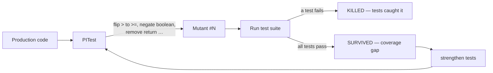
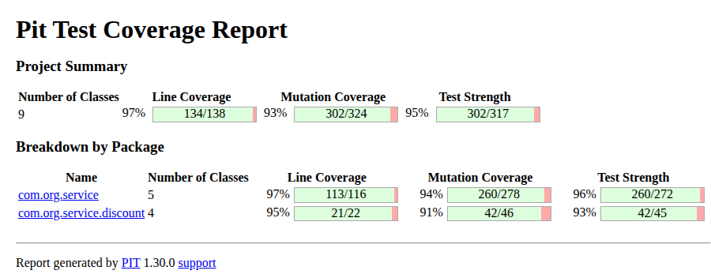
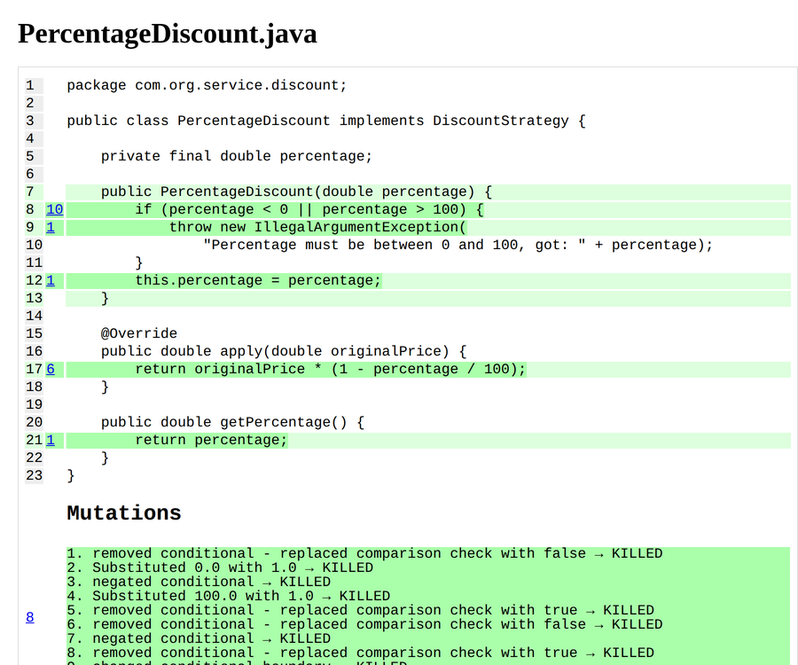

# <span style="color:hsl(74,80%,58%)">Mutation Testing with PITest</span>

<picture>
  <source media="(prefers-color-scheme: dark)" srcset="https://raw.githubusercontent.com/hcoles/pitest-site/gh-pages/images/pit-white-150x152.png">
  
</picture>

## <span style="color:hsl(212,80%,58%)">Table of contents</span>

1. 🧬 [What is Mutation Testing?](#what-is-mutation-testing)
2. 🔨 [Parent POM Hierarchy](#parent-pom-hierarchy)
3. 🏗️ [Project Structure](#project-structure)
4. 🏗️ [Design Patterns (GoF)](#design-patterns-gof)
5. 🧰 [Tech Stack](#tech-stack)
6. 🧪 [JUnit Jupiter Features Used](#junit-jupiter-features-used)
7. 🧬 [PITest Mutation Coverage — What Each Test Kills](#pitest-mutation-coverage--what-each-test-kills)
8. 🧪 [Running Tests](#running-tests)
9. 🧬 [Running Mutation Coverage Only](#running-mutation-coverage-only)
10. 📚 [References](#references)

A Maven project demonstrating mutation testing using [PITest](https://pitest.org) with JUnit 6 (Jupiter API) and Java 27. Current run: 177 tests, 324 mutations, 93% killed, test strength 95%.
Inherits shared plugin management from the corporate `super-pom`.

---

<a id="what-is-mutation-testing"></a>
## <span style="color:hsl(349,80%,58%)">1. 🧬 What is Mutation Testing?</span>

Mutation testing evaluates test-suite quality by automatically introducing small code changes (mutations)
into production source — flipping `>` to `>=`, negating a boolean, removing a return value — then running
the tests against each mutated version.

| Result       | Meaning                                               |
|--------------|-------------------------------------------------------|
| **Killed**   | At least one test failed — the mutation was caught. ✓ |
| **Survived** | All tests passed — a coverage gap was revealed. ✗     |

The goal is to maximise the percentage of killed mutants.


```mermaid
flowchart LR
    src[Production code] --> pit[PITest]
    pit -->|"flip > to >=, negate boolean,<br/>remove return …"| mut["Mutant #N"]
    mut --> tests[Run test suite]
    tests -->|"a test fails"| killed["KILLED — tests caught it"]
    tests -->|"all tests pass"| survived["SURVIVED — coverage gap"]
    survived --> fix["strengthen tests"] --> pit
```

---

<a id="parent-pom-hierarchy"></a>
## <span style="color:hsl(127,80%,58%)">2. 🔨 Parent POM Hierarchy</span>

```
org.springframework.boot:spring-boot-starter-parent:4.1.1
  └── com.org.llm:super-pom:1.2.0
        └── com.org.test:mutation-testing:1.0-SNAPSHOT
```

The super-pom supplies:

<ul>

- `java.version` **27** → `maven.compiler.release` 27 (not overridden here), plus an enforcer
  rule that the build runs on JDK 27+
- `maven-surefire-plugin` (3.x with JUnit Platform auto-detection)
- `spring-boot-maven-plugin` — **skipped** (no application class)
- `git-commit-id-maven-plugin` — **skipped** (not needed for a test module)
- `jacoco-maven-plugin` in `<pluginManagement>` (opt-in) — not activated here. The pinned 0.8.15
  instruments this project's Java 27 classes (major version 71) fine (0.8.13 could not even read
  Java 25's major version 69). To enable it, declare the plugin and write surefire's argLine as
  `@{argLine} --add-opens java.base/java.lang=ALL-UNNAMED`: the super-pom's plain `--add-opens`
  argLine otherwise replaces the JaCoCo agent, and the report is skipped for lack of `jacoco.exec`
- `pitest-maven.version` / `pitest-junit5-plugin.version` — 1.30.0 / 1.2.3, the latest releases
  (checked Sep 2026). This pom pins both through those properties; the super-pom itself only wires
  PIT inside its opt-in `mutation-test` profile. PIT had the same class-file problem: 1.19.1 failed
  with "Unsupported class file major version 69"; 1.30.0 mutates Java 27 bytecode

</ul>

---

<a id="project-structure"></a>
## <span style="color:hsl(264,80%,58%)">3. 🏗️ Project Structure</span>

```
src/
├── main/java/com/org/service/
│   ├── AbstractService.java              GoF: Template Method — shared validation guards
│   ├── CalculatorService.java            arithmetic, predicates, clamp, factorial, isPrime
│   ├── StockService.java                 inventory add/deduct (extends AbstractService)
│   ├── DiscountService.java              GoF: Strategy context
│   ├── BankAccount.java                  GoF: Builder — deposit/withdraw/transfer/interest
│   └── discount/
│       ├── DiscountStrategy.java         GoF: Strategy interface (@FunctionalInterface)
│       ├── PercentageDiscount.java       percentage-off implementation
│       ├── FlatDiscount.java             flat-amount implementation (floors at 0)
│       ├── NoDiscount.java               GoF: Null Object — no-op implementation
│       └── DiscountStrategyFactory.java  GoF: Factory Method — creates strategies by type
└── test/java/com/org/service/
    ├── TestCalculatorService.java
    ├── TestStockService.java
    ├── TestDiscountService.java
    └── TestBankAccount.java
```

---

<a id="design-patterns-gof"></a>
## <span style="color:hsl(42,80%,58%)">4. 🏗️ Design Patterns (GoF)</span>

| Pattern         | Where applied                                         | Why                                                    |
|-----------------|-------------------------------------------------------|--------------------------------------------------------|
| Template Method | `AbstractService` ← `StockService`, `DiscountService` | Reuse guard-clause logic without duplication           |
| Strategy        | `DiscountStrategy` + implementations                  | Swap discount algorithms at runtime                    |
| Factory Method  | `DiscountStrategyFactory.create(Type, double)`        | Single creation point; avoids `new` scattered in tests |
| Null Object     | `NoDiscount`                                          | Eliminates null checks in `DiscountService`            |
| Builder         | `BankAccount.Builder`                                 | Readable construction with multiple optional fields    |

---

<a id="tech-stack"></a>
## <span style="color:hsl(179,80%,58%)">5. 🧰 Tech Stack</span>

| Component               | Version | Source                                                       |
|-------------------------|---------|--------------------------------------------------------------|
| Java                    | 27      | super-pom 1.2.0 `java.version`                               |
| JUnit Jupiter (JUnit 6) | 6.0.3   | managed by Spring Boot 4.1.1 (via super-pom)                 |
| PITest (pitest-maven)   | 1.30.0  | super-pom `pitest-maven.version` (as of Sep 2026)            |
| pitest-junit5-plugin    | 1.2.3   | super-pom `pitest-junit5-plugin.version`; works with JUnit 6 |
| maven-surefire-plugin   | 3.x     | inherited (super-pom → spring-boot-starter-parent)           |
| maven-compiler-plugin   | 3.x     | inherited (super-pom → spring-boot-starter-parent)           |

---

<a id="junit-jupiter-features-used"></a>
## <span style="color:hsl(317,80%,58%)">6. 🧪 JUnit Jupiter Features Used</span>

| Feature                                   | Where                                      |
|-------------------------------------------|--------------------------------------------|
| [`@Nested`][Nested]                       | All test classes — groups by behaviour     |
| [`@ParameterizedTest`][ParameterizedTest] | All test classes                           |
| [`@CsvSource`][CsvSource]                 | Multi-argument boundary cases              |
| [`@ValueSource`][ValueSource]             | Single-argument predicate cases            |
| [`@DisplayName`][DisplayName]             | Every class and method                     |
| [`@BeforeEach`][BeforeEach]               | `TestCalculatorService`, `TestBankAccount` |
| `assertAll`                               | Multi-field state verification             |
| `assertThrows` + message                  | Every guard clause                         |

---

<a id="pitest-mutation-coverage--what-each-test-kills"></a>
## <span style="color:hsl(94,80%,58%)">7. 🧬 PITest Mutation Coverage — What Each Test Kills</span>

What `mvn verify` leaves in `target/pit-reports/` for this project — the summary, and one class
opened up: every covered line carries its mutant count, and each mutant says how it was killed:

<p align="center">
  
</p>

<p align="center">
  
</p>

<p align="center"><sub>Screenshots of this repository's own PIT 1.30.0 report.</sub></p>

| Mutator                 | Example                    | Killed by                                                      |
|-------------------------|----------------------------|----------------------------------------------------------------|
| `CONDITIONALS_BOUNDARY` | `> 0` → `>= 0`             | `isPositive(0)` asserts false; `hasEnough(10,10)` asserts true |
| `NEGATE_CONDITIONALS`   | `isEmpty` → `!isEmpty`     | Separate true/false test cases for every predicate             |
| `MATH`                  | `a + b` → `a - b`          | Exact value assertions on every arithmetic result              |
| `PRIMITIVE_RETURNS`     | `return x` → `return 0`    | `assertEquals(expected, actual)` everywhere                    |
| `VOID_METHOD_CALLS`     | skip `validateNonNegative` | State-unchanged assertions after rejected inputs               |
| `INLINE_CONSTS`         | `n < 2` → `n < 3`          | `isPrime(2)` asserts true                                      |
| `NULL_RETURNS`          | `build()` → `return null`  | Builder test reads fields after `build()`                      |
| `FALSE_RETURNS`         | `canWithdraw` → false      | Exact-equal boundary cases assert true                         |
| `TRUE_RETURNS`          | `isEmpty` → true           | `new StockService(1).isEmpty()` asserts false                  |

`<mutator>ALL</mutator>` also switches on `INCREMENTS`, but it generates nothing here: the only
increment is `isPrime`'s loop counter (`i += 2`), and PIT drops mutants on loop counters because
they tend to loop forever.

The 22 mutants that are not killed fall into three groups:

<ul>

- **Equivalent mutants** — the change doesn't alter behaviour, so no test can kill them:
  `max`'s `a >= b` → `a > b` and the same in `min` (equal inputs return the same value either way),
  `clamp`'s boundaries,
  `factorial`'s `n == 1` shortcut (1 × 0! is still 1), and `BankAccount.Builder`'s `= 0.0`
  initialisers (the field default is already 0.0)
- **No coverage** — `AbstractService.validatePositive` is never called, so PIT flags its 6 mutants
  as dead code
- **Real gaps** you could close — e.g. `FlatDiscount`'s `discounted < 0` → `< 1` survives because
  no test lands a discounted price between 0 and 1

</ul>

---

<a id="running-tests"></a>
## <span style="color:hsl(232,80%,58%)">8. 🧪 Running Tests</span>

```bash
mvn test                  # the 177 unit tests, then PIT (it is bound to the test phase)
mvn test -DskipPitest     # the unit tests only
```

<a id="running-mutation-coverage-only"></a>
## <span style="color:hsl(9,80%,58%)">9. 🧬 Running Mutation Coverage Only</span>

```bash
mvn test-compile org.pitest:pitest-maven:mutationCoverage
```

PIT needs compiled classes, hence `test-compile` first; the goal picks up the `<configuration>`
from the pom. HTML report: `target/pit-reports/index.html` (1.30.0 doesn't timestamp report
folders unless `timestampedReports` is set).

---

<a id="references"></a>
## <span style="color:hsl(147,80%,58%)">10. 📚 References</span>

<ul>

- [PITest official site](https://pitest.org)
- [PITest mutator documentation](https://pitest.org/quickstart/mutators/)
- [pitest-junit5-plugin](https://github.com/pitest/pitest-junit5-plugin)
- [JUnit User Guide (6.0.3)](https://docs.junit.org/6.0.3/overview.html)

</ul>

<!-- Library classes mentioned above, linked to their source at the versions this project builds with. -->

[BeforeEach]: https://github.com/junit-team/junit-framework/blob/r6.0.3/junit-jupiter-api/src/main/java/org/junit/jupiter/api/BeforeEach.java
[CsvSource]: https://github.com/junit-team/junit-framework/blob/r6.0.3/junit-jupiter-params/src/main/java/org/junit/jupiter/params/provider/CsvSource.java
[DisplayName]: https://github.com/junit-team/junit-framework/blob/r6.0.3/junit-jupiter-api/src/main/java/org/junit/jupiter/api/DisplayName.java
[Nested]: https://github.com/junit-team/junit-framework/blob/r6.0.3/junit-jupiter-api/src/main/java/org/junit/jupiter/api/Nested.java
[ParameterizedTest]: https://github.com/junit-team/junit-framework/blob/r6.0.3/junit-jupiter-params/src/main/java/org/junit/jupiter/params/ParameterizedTest.java
[ValueSource]: https://github.com/junit-team/junit-framework/blob/r6.0.3/junit-jupiter-params/src/main/java/org/junit/jupiter/params/provider/ValueSource.java
